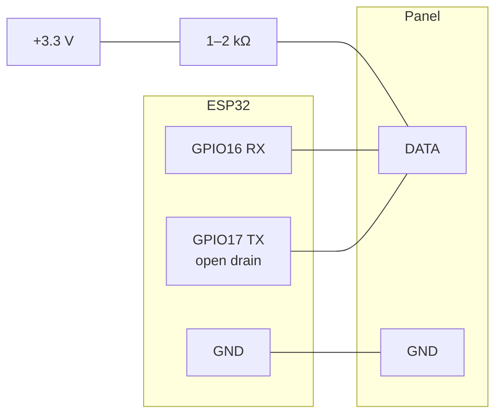

# Nanoleaf Shapes panel bus protocol

Reference specification of the serial bus between a Nanoleaf Shapes controller and its light panels. Written so that a
third party can drive the panels with their own bus master, or build a compatible panel.

This document is licensed under the MIT licence (see `LICENSE`).

This specification is an independent description of an interface. No panel firmware was extracted or read, no vendor
documentation, source code or confidential material was used, and no protected mechanism was circumvented.

---

## 1. Scope

|                                  |                                                                                                                                                                                                             |
|----------------------------------|-------------------------------------------------------------------------------------------------------------------------------------------------------------------------------------------------------------|
| Panels                           | Nanoleaf **Shapes Mini Triangle** (NL48) and **Shapes Triangle** (NL47), 13 + 1 panels in one assembly. Shapes Hexagon (NL42) geometry is given but untested — no unit was available.                       |
| Bus master used for verification | ESP32-D0WD-V3, MicroPython v1.29.0, `firmware/` in this repository                                                                                                                                          |
| Independent verification         | 9 Mini Triangles in chain, fork and ring arrangements, ESP32-C5 with a buffered interface: [Cptmeme's protocol notes][cpt]. Findings taken from there are credited inline ([Cptmeme][cpt]); see section 11. |
| Covered                          | physical layer, framing, enumeration, color and brightness, touch events, layout string grammar and the geometry derived from it, hot-plug detection                                                        |
| Deliberately not covered         | panel firmware update (`FE flood`), assignment of per-panel short ids, multi-zone panels (Elements, Lines, Canvas), the Rhythm module, the controller's own Wi-Fi API                                       |

## 2. Minimal working sequence

From "panels powered" to "panels lit in a color of your choice":

1. Connect the bus master to a panel's DATA pad through an **open-drain**
   output with a 1–2 kΩ pull-up to 3.3 V, and share GND (section 3).
2. Open the UART at **1 000 000 baud, 8N1**.
3. Send the single byte `00` (*root side detect*). No reply. Wait ~20 ms.
4. Send the single byte `80` (*layout detect*). Read until the terminator
   `40`. Count the bytes with bit 7 set whose connector code (bits 6..4) is not `1` — that is the number of panels,
   **N**.
5. Send `FC 04 FF` — brightness 255. No reply.
6. Send `E0 03` followed by N chunks of `05 01 R G B W` — one chunk per panel. No reply.
7. From now on send `C0` every **50 ms** and read the 2·N reply bytes. Without this poll the panels apply the first
   color frame and ignore the next ones. The pairs come in **layout-string order**, the opposite of the chunks in step 6
   (section 5.3).

Repeat step 6 whenever the colors change. Steps 3–4 are needed again only after a panel is added, removed or moved
(section 8, `CC`).

## 3. Physical layer

The panel edge connector has three spring-loaded sliding pads, ~10 × 1.5 mm on a 1 mm pitch, no keying:

| pad | function                                                      |
|-----|---------------------------------------------------------------|
| 1   | **+42 V** supply                                              |
| 2   | GND                                                           |
| 3   | **DATA**, 3.3 V logic (labelled `EDGE` on the controller PCB) |

Panels are chained through linkers that carry the same three signals. Power enters at any one connector of the assembly:
the power supply is a bus node of its own (section 7.4).

The supply pad carries 42 V next to a 3.3 V logic pad with no keying, so mind the pad order when attaching a tap; the
reference build simply solders to DATA and GND on a linker.

### 3.1 The master must release the line

DATA is a single wire shared by both directions. A panel can only answer if the master's transmitter is **high-impedance
when idle**. A push-pull UART output (any USB-UART adapter) holds the line at logic 1 and the panel cannot pull it down:
you see your own echo and never a reply. A series resistor weakens the conflict but on Shapes it is not enough.

The stock controller uses tri-state buffers switched by recent TX activity. The equivalent on a microcontroller is an
**open-drain TX with an external pull-up**:



With a buffered tri-state interface the panels themselves hold DATA high on an idle bus and no pull-up was needed
([Cptmeme][cpt]). Whether that is enough for an open-drain master is not verified; the external pull-up below is what
the reference build uses.

The pull-up must be external and strong: an internal ~45 kΩ pull-up cannot give clean edges at 1 Mbaud. Verify by
transmitting `55 AA 55 AA 0F F0` and comparing the echo — 20 of 20 clean echoes means the line is usable.

On an ESP32 the pad driver bit is set after the UART is initialised (initialising the UART clears it):
`GPIO_PINn_REG |= (1 << 2)` with
`GPIO_PIN0_REG = 0x3FF44088` on the original ESP32 (`firmware/panelbus.py`).

## 4. Link layer

| parameter   | value                                                          |
|-------------|----------------------------------------------------------------|
| line coding | UART, 8 data bits, no parity, 1 stop bit                       |
| bit rate    | 1 000 000 baud                                                 |
| duplex      | half, single wire; the master hears its own echo               |
| direction   | the master initiates every exchange; panels never speak first  |
| framing     | first byte is the frame type; length is implied by the type    |
| integrity   | **no CRC, no length field, no acknowledgement** for SET frames |

### 4.1 Frame types

The type byte forms a prefix code. Bits set from the top select the class:

| type | name             | direction          | reply                                     |
|------|------------------|--------------------|-------------------------------------------|
| `00` | root side detect | master → all       | none                                      |
| `80` | layout detect    | master → all       | layout string, terminated by `40`         |
| `C0` | bulk pull        | master → all       | 2 bytes per panel                         |
| `E0` | bulk push        | master → all       | none                                      |
| `F8` | node command     | master → one panel | 1 ack byte per hop, then payload for GET  |
| `FC` | global command   | master → all       | payload for GET, none for SET             |
| `FE` | flood            | master → all       | none (panel firmware update, not covered) |

Command bytes inside `F8`/`FC`: `cmd < 0x80` is a SET and has no reply;
`cmd ≥ 0x80` is a GET and has a reply.

### 4.2 Timing

Measured on the stock controller:

| what                                                       | value                                                      |
|------------------------------------------------------------|------------------------------------------------------------|
| bulk pull period, steady state                             | **50 ms** (median 50.1 ms, jitter < 1 ms)                  |
| bulk push                                                  | sent between polls, no fixed cadence, up to ~20/s observed |
| enumeration retry on an empty edge                         | `00`×5 then `80`, repeated after 3 s                       |
| time from `00` to `80` in the controller's own enumeration | ~100 ms                                                    |

Reply latency grows with the hop count because every panel relays the bus (section 4.3). Windows that worked with up to
14 panels:

| exchange             | read window                                                    |
|----------------------|----------------------------------------------------------------|
| layout detect        | 200 ms + 40 ms × N                                             |
| bulk pull            | 40 ms + 20 ms × N                                              |
| node GET (`F8 … 8x`) | 400 ms for the far end of a 4-panel chain; 120 ms is too short |

The bus is not the bottleneck: color frames at up to 40 per second with `C0` every 50 ms run without dropouts
([Cptmeme][cpt]). The ~16 frames per second of `firmware/` are the limit of the MicroPython interpreter.

Two obligations of the master:

* **Keep polling.** Without `C0` polls the panels apply only the first color frame and ignore the following ones.
  Polling once a second is enough; 50 ms is what the stock controller does.
* **Do not pause for seconds.** After a gap of ~2 s in all traffic the next color frame is ignored as well; resume
  polling before sending it.

### 4.3 Topology: panels are repeaters

The wire between two neighbouring panels is **not** a shared multi-drop bus. Every panel is an active node that forwards
traffic between its connectors, so an assembly is a tree rooted at the master.

On a connector with no neighbour a panel sends only the neighbour-discovery probe: `00`×5 and `80` twice at start-up,
then `C0` every 50 ms forever. No
`E0`, `FC` or `F8` is ever forwarded to an empty connector.

## 5. Enumeration and addressing

### 5.1 Root side detect (`00`)

A single byte, no reply. Every panel records **the connector on which the byte arrived** as its root connector, i.e. the
direction towards the master.

A panel that was enumerated by another master keeps that root until it receives a fresh `00`; until then it ignores your
frames. Always send `00`
before `80`.

### 5.2 Layout detect (`80`)

A single byte. The reply is the **layout string**: a depth-first walk of the tree, one node byte per device, terminated
by `40`. Grammar and geometry are in section 7.

The reply is assembled hop by hop, so its latency and its corruption rate both grow with N (section 9.2). Read it more
than once and accept a string that repeats.

### 5.3 Panel index and chunk order

Panels are addressed positionally in `bulk push` and `bulk pull`, but **the two frames use opposite orders**
([Cptmeme][cpt]):

| frame            | order                            | first entry                      |
|------------------|----------------------------------|----------------------------------|
| `E0` push chunks | **reverse** of the layout string | the last panel of the string     |
| `C0` pull pairs  | **same as** the layout string    | the panel attached to the master |

Positions count panel nodes only; the power supply node `95` has neither a chunk nor a pair. With *p* the position of a
panel in the layout string:

```
chunk index = N − 1 − p
pair index  = p
```

The pull order is the depth-first order of the string, not breadth-first: with the master on a middle panel of a fork,
every panel's pair matched its string position, which breadth-first order would have swapped between the branches. It
holds across power cycles and with the master moved to the other end of a chain. On a symmetric assembly the two orders
are easy to confuse; touch a panel at one end to tell them apart.

### 5.4 Node addressing (`F8`)

`F8 <id_lo> <id_hi> <cmd> [payload]` reaches a single panel by its 16-bit little-endian **self-assigned id**. Every
panel on the path answers with one acknowledgement byte before the addressee's payload: `00` = "not me",
`01` = "me":

```
F8 00 00 82 → 01           <18 bytes uid>
F8 01 00 82 → 00 01        <18 bytes uid>
F8 02 00 82 → 00 00 01     <18 bytes uid>
```

The id is **not** the chunk index and not the position in the tree. The stock controller hands ids out after
enumeration; this step is not part of this specification yet. Panels keep an id across power cycles, so `F8`
works on panels the stock controller once enumerated and stops working after the panels are rearranged. Colour and
brightness do not depend on ids.

## 6. Command reference

### 6.1 Global and node commands (`FC cmd …`, `F8 id cmd …`)

| cmd  | payload             | reply               | function                                       |
|------|---------------------|---------------------|------------------------------------------------|
| `04` | 1 byte              | —                   | brightness 0–255                               |
| `06` | 5 bytes `R G B W T` | —                   | legacy color (Aurora), **no effect on Shapes** |
| `07` | 1 byte              | —                   | touch reporting enable                         |
| `08` | 1 byte              | —                   | keep-alive: extend the panel reset timer       |
| `09` | 0/2/4 bytes         | —                   | low-power mode, touch sensitivity              |
| `81` | —                   | version, panel type |                                                |
| `82` | —                   | 18 bytes            | panel uid                                      |
| `83` | —                   |                     | low-power subtype                              |
| `85` | —                   |                     | orientation                                    |
| `86` | —                   |                     | ambient light sensor                           |

`06` exists in the controller's command catalogue but Shapes panels do not act on it, global or addressed — color goes
through `bulk push` only.

### 6.2 Bulk push (`E0`) — color

```
E0 03 <chunk_0> <chunk_1> … <chunk_N−1>
```

One chunk per panel, in chunk order (section 5.3). The `03` after the type byte is constant in every frame observed.

Chunk of a single-zone panel (all Shapes):

```
05 T R G B W
│  │ └───┬───┘
│  │     └── color; W drives the dedicated white LEDs
│  └── transition time
└── data length (5)
```

Skip chunk — leave that panel unchanged: `01 FF`.

`T` is the fade time. The stock controller uses 1–2 for immediate changes and 10–20 for effects; its "turn off" effect
sets a random 3–22 per panel so that panels fade out staggered. Units are unverified, presumably 100 ms steps as in the
public Nanoleaf API.

`R=G=B=255, W=0` gives a cold, bluish white from the color LEDs only. Warm and neutral whites need `W`; the panel maps
RGBW onto separate cold and warm white LEDs internally.

The chunk length byte is per panel type; multi-zone panels of the same family use longer records (`12` = six RGB
triplets for a six-zone device, `0A`, `06`
for others). A Shapes Triangle has six connectors but **one zone** and uses the ordinary 5-byte chunk.

### 6.3 Bulk pull (`C0`) — status and touch

`C0` → 2 bytes per panel, in **layout-string order** (section 5.3), not chunk order.

The first byte of a pair is a status byte made of independent bits:

| value         | meaning                                                                                     |
|---------------|---------------------------------------------------------------------------------------------|
| `00`          | idle, no touch                                                                              |
| `10`          | first poll after enumeration, and the first poll after a touch is released ([Cptmeme][cpt]) |
| `11` … `17`   | touch; the low nibble varies with the gesture                                               |
| `+20`         | bit `0x20`, ORed with the above: `20` idle, `32`/`37` touch, `30` release ([Cptmeme][cpt])  |
| trailing `CC` | **hot-plug** (section 8)                                                                    |

Bit `0x20` was seen on the panel the power supply is plugged into, which in that setup was also the panel the stock
controller had used; which of the two it marks is open. It appeared after the panels powered up and was absent after the
master alone restarted. Test for a touch with

```
(status & 0x10) && (status & 0x0F)
```

A comparison against `11`…`17` misses touches on the `0x20` panel.

## 7. Layout string

The layout string is the only place where the assembly's shape is encoded. Everything else (chunk order, coordinates,
the location of the power supply)
is derived from it.

### 7.1 Node byte

Every device — panel or power supply — contributes one node byte with bit 7 set:

```
bit 7      always 1
bits 6..4  connector-count code
bit  3     unused (0)
bits 2..0  root connector: the connector facing the master
```

| code    | connectors                                    |
|---------|-----------------------------------------------|
| `0`     | 8                                             |
| `1`     | 0 — **power supply node** (`95`), not a panel |
| `2`–`6` | 2–6                                           |
| `7`     | 9                                             |

Codes `0` and `7` are escapes for counts that do not fit in three bits. **Connectors are counted, not sides**: a Shapes
Triangle has two connectors per side and reports 6; a Mini Triangle and a Hexagon report 3 and 6 respectively.

Observed nodes:

| node                | code | root    | device                                  |
|---------------------|------|---------|-----------------------------------------|
| `B0` `B1` `B2`      | 3    | 0/1/2   | Mini Triangle                           |
| `E1` `E3` `E4` `E5` | 6    | 1/3/4/5 | Triangle                                |
| `95`                | 1    | —       | power supply (root connector undefined) |

### 7.2 Grammar

After a node byte, the parser walks that node's connectors **in a circle starting at `root + 1`**. Let `e` be the
current connector and `N` the node's connector count:

```
byte with bit 7 set    a child subtree hangs on connector e; e is unchanged
byte with bit 7 clear  separator: e := (e + 1) mod N
                       when e wraps round to root the node is complete and
                       the byte is NOT consumed — it belongs to the parent
```

Equivalently: a node owns exactly **N − 2 separators** (one for a triangle, four for a six-connector panel) and ends at
the next separator after that. The connector on which a child sits is the parent's `e` at the moment the child byte
appears; the child's own root connector is in the child's node byte. That pair is sufficient for the geometry.

The terminator `40` follows the root node.

### 7.3 Separator values: panel subtype

Separator bytes are not padding. The first separators of a node carry the panel subtype:

| connectors | which separator | bits | value → subtype                                                         |
|------------|-----------------|------|-------------------------------------------------------------------------|
| 3          | first           | 4..2 | 0 or 1 → **Mini Triangle** (`04` on the wire)                           |
| 6          | second          | 2..0 | 1 → Hexagon, **2 → Triangle**, 3 → Elements (`00 02 00 00` on the wire) |

The first separator of a six-connector node also carries a bit mask over its connectors (bit k−1 ↔ connector root + k);
its meaning was not needed.

### 7.4 Power supply node

`95` is the power supply. It appears exactly once, and its position in the string tells which panel and which
**connector** it is plugged into. The stock firmware inserts and removes this node explicitly and uses it to estimate
the worst-case supply location.

### 7.5 Worked examples

```
1 panel:    B1 04 95 40
2 panels:   B1 B0 04 04 95 40
4, forked:  B1 B0 04 B2 04 04 B2 04 95 40
4, star:    B1 B0 B1 04 04 B2 04 04 95 40
```

The star, read with the grammar:

```
B1 root=1                        master panel, chunk 3
  connector 2 → B0 root=0        centre, chunk 2
    connector 1 → B1 root=1      chunk 1
    connector 2 → B2 root=2      chunk 0
  connector 0 → 95               power supply
```

A 13 + 1 assembly, Mini Triangles and one Triangle (`E3`, four separators
`00 02 00 00`):

```
B1 B0 04 B2 B2 B0 B1 B1 04 E3 00 02 00 00 04 04 04 B2 04 04 04 B1 B1 B2 04 B1 B1 04 04 04 95 04 40
```

### 7.6 Geometry

The controller computes panel positions from this same tree and exposes them as `positionData` in its public API. The
root panel sits at (0, 0) with orientation 0; children are placed recursively.

Notation: `pe` parent connector, `ce` child's root connector,
`a(shape, e)` the angle of the side that carries connector `e`,
`v(shape, e)` the vector from the panel centre to connector `e` in the panel's own frame, y up, `R(θ)` counter-clockwise
rotation.

```
o_child = (o_parent + 180 + a(child, ce) − a(parent, pe)) mod 360
P_child = P_parent + R(o_parent) · [ v(parent, pe) − R(o_child − o_parent) · v(child, ce) ]
```

| shape (API id)    | side, mm | `a(e)`                   | `v(e)`                                                      |
|-------------------|----------|--------------------------|-------------------------------------------------------------|
| Mini Triangle (9) | 67       | `120·e`                  | `(0, −19.34)` rotated by `−a(e)`                            |
| Triangle (8)      | 134      | `120·(((e+1)>>1) mod 3)` | `(∓33.5, −38.68)` rotated by `−a(e)`; `−` for e ∈ {0, 2, 4} |
| Hexagon (7)       | 67       | `60·e`                   | `(0, −58.02)` rotated by `−a(e)`                            |

19.34 and 38.68 mm are the inradii (`s / 2√3`), 58.02 the hexagon apothem (`s·√3 / 2`), 33.5 a quarter side: the two
connectors of a Triangle side sit where the midpoints of two Mini Triangle sides would. Connectors are numbered
**clockwise** when the panel is viewed from the front. By construction the child's connector lands exactly on the
parent's, so the tiling has no gaps and no overlaps.

Verified on a 13 + 1 assembly in several arrangements, including a Triangle in each of its three orientations on one
linker, and independently on a 9-panel ring (section 7.7) ([Cptmeme][cpt]).

#### 7.6.1 Panel-center lattice

Every panel centre produced by these formulas lies on a rectangular lattice with cells of

```
side_mini / 4  ×  side_mini / (2√3)  =  16.75 × 19.341 mm
```

for Mini Triangles in either orientation, Triangles and Hexagons alike, as long as the root orientation is a multiple of
60° ([Cptmeme][cpt]). Dividing `x` and `y` by the cell size therefore gives exact integer coordinates. This is the
natural way to map an assembly onto a 2D pixel matrix for effects: on a square grid the √3 aspect ratio forces rounding
and neighboring panels end up unevenly spaced.

### 7.7 Rings

Panels may be connected in a closed loop. The panels break the loop themselves: a ring of six Mini Triangles with three
more attached enumerated as 9 panels, each exactly once, with the same string on repeated enumerations ([Cptmeme][cpt]).
The link that was dropped is not part of the tree; the geometry puts its two connectors on the same point.

On one enumeration the first separator of one end of the dropped link read `05` instead of `04`, bit 0 set for the
connector that closes the ring. A later enumeration of the same ring showed `04`, so this bit cannot be relied on.

```
B0 B0 B1 04 04 B0 95 04 04 B1 B1 B0 05 04 04 B2 04 B0 04 40
```

Reference implementation: `firmware/geometry.py` (pure Python, runs on the host and in MicroPython); tests in `tests/`.

## 8. Events

Panels never initiate traffic. Touch and hot-plug arrive in the `bulk pull`
reply (section 6.3):

* **Touch.** The panel's status byte has bit `0x10` and a non-zero low nibble for the polls during which the panel is
  touched (section 6.3).
  `FC 07 <n>` configures touch reporting; the stock controller sends `FC 07 00` around effect changes.
* **Hot-plug.** When a panel is added, removed or moved, the reply gains a trailing `CC` after the pairs of the panels
  still present. The master must run `00` + `80` again; the moved panel silently stops applying color until it does.
* `CC` also follows the first enumeration after the master restarts while the panels stay powered, with no change to the
  assembly ([Cptmeme][cpt]). A second `00` + `80` clears it. Re-enumerate on every `CC` without trying to tell the
  causes apart.

## 9. Quirks and variations

### 9.1 Legacy color command

`FC 06 R G B W T` and `F8 id 06 …` are accepted silently and do nothing on Shapes. The command belongs to the
first-generation (Aurora) panels and survives in the controller's catalogue because the catalogue is a superset for the
whole family.

### 9.2 Corrupted head of the layout string

On assemblies of about 14 panels the first ~14 bytes of the layout string arrive with spurious 1-bits (`B0→B8/F0`,
`04→24/84`, `00→40/80`); the tail is always clean, the master's own echo is clean, and the pause after `00`
does not matter. A corrupted node byte can name a root connector that does not exist (e.g. `EF`, root 7 on a
six-connector panel), which would make the stock parser loop. Read the string up to six times and use one that repeats;
if a node still has an impossible root connector, choose the connector that places the panel farthest from the panels
already placed. Cause unknown.

### 9.3 Triangle: six connectors, one zone

A Shapes Triangle reports six connectors in its node byte and owns four separators in the string, but it is a single
light zone: one ordinary 5-byte chunk in `bulk push`, one pair in `bulk pull`.

### 9.4 Ids after rearrangement

After panels are physically rearranged, some stop answering `F8` while
`bulk pull` and `bulk push` keep working for all of them. The ids were given by a previous master; this specification
does not yet describe how to assign them (section 5.4).

### 9.5 Reply windows

A far panel that does not answer within 120 ms answers fine within 400 ms. Treat "no reply" as "window too short" before
treating it as "no panel".

### 9.6 White

The color LEDs alone cannot produce a neutral white; `R=G=B=255, W=0`
is visibly blue-tinted. Use the `W` byte.

## 10. Glossary

| term                 | meaning                                                                                                    |
|----------------------|------------------------------------------------------------------------------------------------------------|
| **assembly**         | all panels connected to one master                                                                         |
| **bus master**       | the device that initiates every exchange: the stock controller or your microcontroller                     |
| **bulk pull**        | `C0` frame; polls status and touch from every panel                                                        |
| **bulk push**        | `E0 03 …` frame; sets the color of every panel in one frame                                                |
| **chunk**            | one panel's record inside a bulk push frame, `05 T R G B W` or `01 FF`                                     |
| **chunk index**      | a panel's position in bulk push, `N − 1 − position in the layout string`                                   |
| **pair index**       | a panel's position in the bulk pull reply, equal to its position in the layout string                      |
| **connector**        | one of a panel's edge contacts; a Triangle has two per side                                                |
| **hop**              | one panel-to-panel relay of a frame                                                                        |
| **layout detect**    | `80` frame; asks for the layout string                                                                     |
| **layout string**    | the depth-first encoding of the assembly tree returned by layout detect                                    |
| **linker**           | the passive bridge that joins two panel connectors                                                         |
| **node byte**        | a byte with bit 7 set in the layout string; one per device                                                 |
| **root connector**   | the connector of a panel that faces the master                                                             |
| **root side detect** | `00` frame; tells every panel which connector faces the master                                             |
| **self-assigned id** | the 16-bit address used by `F8`; unrelated to the chunk index                                              |
| **separator**        | a byte with bit 7 clear in the layout string; advances to the next connector and carries the panel subtype |
| **skip chunk**       | `01 FF`; leaves a panel's color unchanged in a bulk push                                                   |
| **zone**             | an independently addressable color region; every Shapes panel has exactly one                              |

[cpt]: https://github.com/Cptmeme/Nanoleaf-Shapes-controller/blob/main/docs/protocol-notes.md
