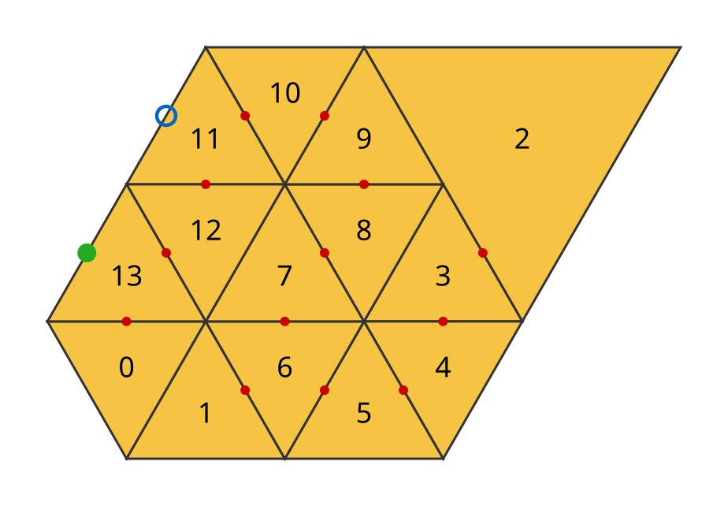
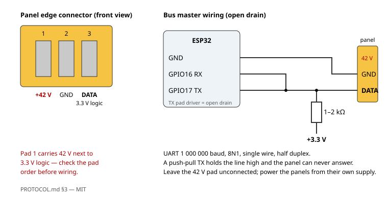

# LeafBus

Drive Nanoleaf Shapes light panels directly over their panel bus — no stock controller, no cloud, no app.



*Layout computed from the bus alone: numbers are chunk indices, dots mark the connector each panel is reached through (
green: where the ESP32 is attached), the blue ring is the power supply.*

An ESP32 replaces the Shapes controller on the three-pin edge connector, enumerates the panels, reads their layout and
pushes color frames at up to
~16 frames per second from MicroPython. The assembly then appears on the network as a pixel sink for DDP and E1.31/sACN,
so any lighting software — xLights, LedFx, Hyperion, WLED sync, a few lines of Python — can play on it. The protocol
itself is documented in [`PROTOCOL.md`](PROTOCOL.md); this repository is its **reference implementation**: written for
correctness and readability, not for speed.

## Status

| feature                                                        | status                                          |
|----------------------------------------------------------------|-------------------------------------------------|
| enumeration, layout string, tree, chunk order                  | ✅                                              |
| panel coordinates and orientation from the layout string alone | ✅ Mini Triangle and Triangle; Hexagon untested |
| color per panel (RGBW + transition time), brightness           | ✅                                              |
| touch events, hot-plug detection and re-enumeration            | ✅                                              |
| DDP and E1.31 receivers, HTTP topology server                  | ✅ E1.31 unicast and multicast                  |
| power supply location                                          | ✅ read from the layout string                  |
| Elements, Lines, Canvas, Hexagon on hardware                   | ❌ not tested                                   |
| panel firmware update                                          | ❌ out of scope                                 |

## The protocol

**[`PROTOCOL.md`](PROTOCOL.md) is the main result of this project.** It is a self-contained specification — physical
layer, framing, timing, enumeration, the layout string grammar and the geometry derived from it — with a minimal working
sequence you can reproduce in an afternoon.

## Hardware

- Nanoleaf Shapes panels with their own power supply (42 V). Verified with 13 Mini Triangles and one Triangle.
- ESP32 (original, e.g. ESP32-D0WD; the S2/S3/C3 need a different GPIO register base, see `firmware/panelbus.py`).
- One resistor, 1–2 kΩ.
- Something to reach the panel's DATA and GND pads: a spare linker with wires soldered on, or pogo pins.



The supply pad next to DATA carries **42 V**; double-check the pad order before wiring and leave that pad alone.

The TX pin **must** be open drain; a push-pull output holds the line high and the panels can never answer. The firmware
sets the pad mode itself.

## Quick start

1. Flash [MicroPython](https://micropython.org/download/ESP32_GENERIC/)
   v1.29 or later onto the ESP32.
2. `cp firmware/config.example.json firmware/config.json` and fill in your Wi-Fi.
3. Copy `firmware/*.py` and `config.json` to the board with your usual tool,
   e.g. [mpremote](https://docs.micropython.org/en/latest/reference/mpremote.html):
   ```
   mpremote cp firmware/*.py firmware/config.json :
   ```
4. Reset the board. It prints its IP and starts listening:
   ```
   panels: 14
   DDP    udp://192.168.1.42:4048
   E1.31  udp://192.168.1.42:5568  universe 1  group 239.255.0.1
   HTTP   http://192.168.1.42/layout
   ```
5. Light it up:
   ```
   tools/leafbus.py send 192.168.1.42 red
   tools/leafbus.py layout 192.168.1.42 --json layout.json --svg layout.svg
   tools/leafbus.py rainbow 192.168.1.42 --layout layout.json
   ```

The tool needs nothing beyond the standard library for DDP; `--e131` uses the [`sacn`](https://pypi.org/project/sacn/)
package (`pip install -r requirements.txt`).

`layout` prints the assembly tree, which chunk index belongs to which panel, where the power supply is, and draws the
picture at the top of this page.
`identify <ip> N` lights one panel so you can match indices to the wall. With `--layout` the rainbow's hue follows the
angle around the assembly instead of the chunk index.

From the REPL, without the network:

```python
import panelbus
import anim

bus = panelbus.PanelBus()
bus.enumerate()
bus.brightness(255)
bus.set_color(255, 0, 0)  # every panel red
bus.push_colors([(255, 0, 0), None, (0, 0, 255)])  # per panel; None = unchanged

anim.rainbow(bus)
```

## Repository

| path               |                                                                                                                                                                                                                                               |
|--------------------|-----------------------------------------------------------------------------------------------------------------------------------------------------------------------------------------------------------------------------------------------|
| `PROTOCOL.md`      | the protocol specification                                                                                                                                                                                                                    |
| `firmware/`        | MicroPython for the ESP32: `panelbus.py` bus driver, `geometry.py` layout string → tree and coordinates, `ddp.py` / `e131.py` / `web.py` network receivers, `app.py` + `main.py` application, `anim.py` on-board demos, `config.example.json` |
| `tools/leafbus.py` | host tool, talks to the board over IP: `layout`, `identify`, `send`, `rainbow`                                                                                                                                                                |
| `tests/`           | layout string parser and geometry, `python -m pytest`                                                                                                                                                                                         |
| `docs/`            | diagrams                                                                                                                                                                                                                                      |

## Licences

Everything here — firmware, tools, tests, the specification and the diagrams — is licensed under the **MIT license**
(`LICENSE`). Implementing `PROTOCOL.md` needs no permission and no attribution in your code.

This is an independent project and is not affiliated with, endorsed by or supported by Nanoleaf. Product names are used
only to identify the hardware the project is compatible with.
